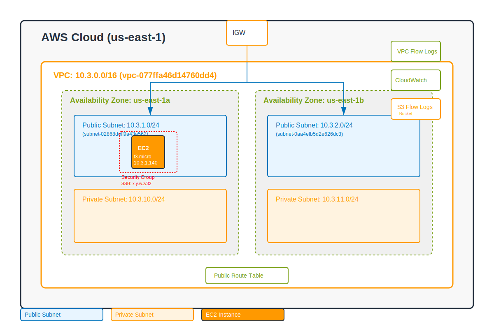

# Bastion EC2 Infrastructure with Terraform

This repository contains production-ready Terraform code for deploying a secure bastion host on AWS following the Well-Architected Framework principles.

## Architecture Overview



### Key Components

1. **VPC**: Custom VPC (10.3.0.0/16) in us-east-1 region
2. **Subnets**: Public and private subnets across 2 availability zones
3. **EC2 Instance**: t3.micro bastion host in public subnet with:
   - Ubuntu 22.04 LTS
   - Instance ID: i-0abe09204bf37a402
   - Public IP: 3.84.206.156
   - Enhanced security with IMDSv2
   - Encrypted EBS volumes
   - Systems Manager Session Manager support
4. **Security**: 
   - Security group with minimal ingress (SSH from specific IP only)
   - IAM roles with least privilege
   - VPC Flow Logs
   - CloudWatch monitoring
   - Fail2ban for SSH protection

### Design Decisions

1. **No NAT Gateway**: To reduce costs, we omitted NAT Gateway. Private subnet resources cannot reach the internet directly.
2. **t3.micro Instance**: Most cost-effective for bastion use case with burstable performance.
3. **Single bastion in one AZ**: For cost optimization. Consider multi-AZ deployment for production workloads.
4. **SSM Session Manager**: Provides an alternative secure access method without exposing SSH to the internet.
5. **VPC Flow Logs to S3**: More cost-effective than CloudWatch Logs for network monitoring.

## Prerequisites

- AWS CLI configured with appropriate credentials
- Terraform >= 1.0
- Existing SSH key pair named "bastion-us-east-1" in the target region

## Directory Structure

```
.
├── .gitignore             # Git ignore patterns
├── CLAUDE.md              # Guidance for Claude AI
├── README.md              # This documentation file
├── bastion-us-east-1.pem  # SSH private key (gitignored)
├── network_diagram.svg    # Architecture diagram
└── terraform/             # Terraform infrastructure code
    ├── main.tf            # Main configuration
    ├── variables.tf       # Variable definitions
    ├── terraform.tfvars   # Variable values with actual IPs (gitignored)
    ├── terraform.tfvars.dev # Development environment variables
    ├── outputs.tf         # Output definitions
    ├── providers.tf       # Provider configuration
    ├── vpc.tf            # VPC resources
    ├── ec2.tf            # EC2 resources
    ├── security.tf       # Security resources
    └── user_data.sh      # EC2 user data script
```

## Deployment Instructions

1. Clone the repository:
   ```bash
   git clone <repository-url>
   cd terraform
   ```

2. Create or use existing terraform.tfvars file:
   ```bash
   # Copy from development environment variables
   cp terraform.tfvars.dev terraform.tfvars
   # Edit to set your specific IP address and other configuration
   ```

3. Initialize Terraform:
   ```bash
   terraform init
   ```

4. Review the planned changes:
   ```bash
   terraform plan
   ```

5. Apply the configuration:
   ```bash
   terraform apply
   ```

6. Save the outputs:
   ```bash
   terraform output > outputs.txt
   ```

## SSH Connection

After deployment, connect to the bastion host using:

```bash
# Using the output command
$(terraform output -raw ssh_command)

# Or manually
ssh -i ~/path/to/bastion-us-east-1.pem ubuntu@<public-ip>
```

## Alternative Access via SSM

```bash
# Using Systems Manager Session Manager
$(terraform output -raw ssm_command)
```

## Variables

| Variable | Description | Default | Type |
|----------|-------------|---------|------|
| `aws_region` | AWS region for resources | us-east-1 | string |
| `environment` | Environment name | dev | string |
| `vpc_cidr` | CIDR block for VPC | 10.3.0.0/16 | string |
| `instance_type` | EC2 instance type | t3.micro | string |
| `allowed_ssh_cidr` | CIDR allowed for SSH | x.y.w.z/32 | string |
| `ssh_key_name` | Existing SSH key pair name | bastion-us-east-1 | string |
| `enable_monitoring` | Enable detailed CloudWatch monitoring | false | bool |
| `root_volume_size` | Root EBS volume size in GB | 20 | number |

## Security Considerations

1. **Network Security**:
   - SSH access restricted to specific IP address (x.y.w.z/32)
   - Minimal egress rules (HTTP/HTTPS/DNS only)
   - VPC Flow Logs enabled for network monitoring

2. **Instance Security**:
   - IMDSv2 enforced
   - EBS volumes encrypted with KMS (Key ID: 57769034-1aba-4c76-93a7-22deb16b4625)
   - Automatic security updates via unattended-upgrades
   - Fail2ban protects against brute force attacks

3. **IAM Security**:
   - Least privilege IAM roles
   - No hardcoded credentials
   - SSM Session Manager for keyless access

4. **Data Security**:
   - All data at rest encrypted
   - CloudWatch logs retention set to 365 days
   - VPC Flow Logs lifecycle policy for automatic deletion

## Cost Estimates

Monthly costs (us-east-1 region):
- EC2 t3.micro instance: ~$8.40
- EBS storage (20GB gp3): ~$1.60  
- Data transfer: Variable (typically <$1 for bastion)
- CloudWatch logs: ~$0.50
- VPC Flow Logs (S3): ~$0.10

**Total estimated cost: ~$11-15/month**

## Maintenance

1. **Updates**: Run `apt update && apt upgrade` regularly or rely on unattended-upgrades
2. **Monitoring**: Check CloudWatch dashboards and logs
3. **Security**: Review security group rules and access logs periodically
4. **Backups**: Consider EBS snapshots for critical data

## Troubleshooting

1. **Cannot SSH to instance**:
   - Verify your IP matches `allowed_ssh_cidr`
   - Check security group rules
   - Ensure the instance is running

2. **SSM Session fails**:
   - Verify the instance has internet connectivity for SSM endpoint
   - Check IAM role permissions
   - Ensure SSM agent is running

3. **Instance not launching**:
   - Check CloudFormation events
   - Verify the SSH key exists in the region
   - Check EC2 service quotas

## Clean Up

To destroy all resources:

```bash
cd terraform
terraform destroy
```

## Current Deployment Status

**Infrastructure is currently deployed with:**
- VPC ID: vpc-077ffa46d14760dd4
- Instance ID: i-0abe09204bf37a402 
- Public IP: 3.84.206.156
- Security Group: sg-08236330645efb9a7
- CloudWatch Log Group: /aws/ec2/bastion-ec2
- VPC Flow Logs S3 Bucket: bastion-ec2-flow-logs-20250516162901387100000001

## Important Files

- **terraform.tfvars**: Contains production configuration including actual IP addresses. This file is gitignored. Create it from terraform.tfvars.dev template.
- **bastion-us-east-1.pem**: SSH private key for bastion access. This file is gitignored and must exist with proper permissions (chmod 400).
- **.gitignore**: Configured to exclude sensitive files (*.pem, terraform.tfvars, terraform state files).

## Contributing

1. Follow Terraform best practices
2. Update documentation for any changes
3. Test in a dev environment first
4. Create pull requests for review

## License

[Your License Here]